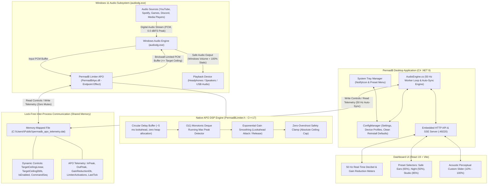

# 🛡️ Permanent Decibel & Hearing Protection Guard

     

**An open-source, always-on Windows system tray utility that permanently enforces safe, comfortable decibel listening levels across all devices, games, videos, and applications.**

---

## 📖 Table of Contents

- [🎧 Overview](#-overview)
- [🔬 How PermadB Protects Your Hearing](#-how-permadb-protects-your-hearing)
- [✨ Key Features](#-key-features)
- [🎧 DJ, Club Events & Live Sound Protection](#-dj-club-events--live-sound-protection-virtualdj-serato-traktor)
- [🩺 Acoustic Safety & WHO Guidelines](#-acoustic-safety--who-guidelines)
- [🎛️ Safe Listening Presets](#️-safe-listening-presets)
- [🏗️ System Architecture](#️-system-architecture)
- [🚀 Quick Start (Installation & Tray Setup)](#-quick-start-installation--tray-setup)
- [🔐 Deployment Architecture](#-deployment-architecture-development-vs-production-signing)
- [🛠️ Building from Source](#️-building-from-source)
- [🗺️ Milestones / Project Status](#️-milestones--project-status)
- [📄 License](#-license)

---

## 🎧 Overview

Permanent hearing damage and tinnitus are irreversible. Modern audio devices and soundcards can easily output acoustic levels upwards of $105\text{ dBA}$ directly into ears or high-power speakers, yet operating systems offer **zero native protection** against uncompressed audio spikes in games, deafening video ads, or accidental volume slider jumps to 100%.

**PermadB** solves this by running permanently in your Windows system tray, actively monitoring CoreAudio endpoints at 50Hz to ensure that every song, movie, game, voice call, or live mix is automatically capped and maintained at safe, fatigue-free decibel levels.

---

## 🔬 How PermadB Protects Your Hearing

### 1. The Acoustic Challenge: Digital $dBFS$ vs. Real-World $dB\text{ SPL}$
* **Digital Volume ($dBFS$):** Windows only processes digital PCM samples from $-\infty$ to $0\text{ dBFS}$. It has no awareness of headphone sensitivity or impedance.
* **Acoustic Pressure ($dB\text{ SPL}$):** Physical sound pressure hitting your eardrums. Sustained exposure to $\ge 85\text{ dBA}$ causes permanent sensorineural hearing loss and tinnitus.
* **PermadB's Solution:** Bridges digital audio to acoustic ear safety by enforcing a strict brickwall digital ceiling directly in the Windows audio pipeline, mapped through a **2.5-power perceptual acoustic curve**.

### 2. Native Lookahead Brickwall Peak Limiter (`PermadBApo.dll`)
* **Zero Volume Slider Manipulation**: PermadB **never** ducks, moves, or changes Windows Master Volume or per-app mixer sliders. Your Windows volume slider stays permanently untouched at **100%**.
* **Lookahead Delay Buffer ($\sim 5\text{ ms}$)**: Intercepts upcoming audio spikes inside `audiodg.exe` *before* they are sent to the DAC/speakers.
* **Monotonic Deque Peak Tracking**: Evaluates multichannel linked peaks in $O(1)$ amortized time with zero heap allocations during real-time audio processing.
* **Zero-Overshoot Safety Clamp**: Output samples are mathematically constrained to $\le \text{Ceiling}$, ensuring zero audio clipping and zero loud transient shocks.

### 3. Perceptual Acoustic Decibel Taper
Human hearing perceives volume logarithmically rather than linearly. PermadB maps slider percentages to digital ceilings using:
$$\text{Linear Ceiling} = 0.89125 \times \left(\frac{\text{Percent}}{100}\right)^{2.5} \implies \text{dBFS} = 20\log_{10}(\text{Linear Ceiling})$$
This guarantees that setting a 30% or 50% ceiling applies genuine, powerful attenuation (e.g. $-27.1\text{ dBFS}$ at 30%) to quiet loud web audio (like YouTube) to safe, comfortable levels.

---

## ✨ Key Features

* **🛡️ Permanent System Tray Resident:**  
  Consumes $< 0.1\%$ CPU and ~60 MB RAM. Crisp anti-aliased dynamic shield icon:
  * 🟢 **Green Shield**: Active & Protecting.
  * 🟡 **Amber Shield**: Custom User Ceiling Active.
  * ⚪ **Gray Shield with Red Slash**: Protection Bypassed.
* **🔒 Pure Digital Limiting (Zero Slider Tampering):**  
  Windows Master Volume and Volume Mixer sliders remain completely static at 100%. All limiting occurs on raw PCM audio inside `audiodg.exe`.
* **🎧 Presets Calibrated for Hearing Health:**  
  * **Safe Ears (65% / ~75 dBA)**: Default daily listening mode compliant with WHO safe exposure guidelines.
  * **Night / Relaxed (50% / ~68 dBA)**: Fatigue-free, ultra-quiet late-night listening.
  * **Studio Dynamic (85% / ~82 dBA)**: Wide dynamic range for mastering and cinema while capping sudden explosions and loud ads.
* **⚡ Sub-Millisecond Lookahead Transient Protection:**  
  Protects against sudden discord screaming, gaming gunshots, accidental full-volume web ads, and jumpscares.
* **🎧 Smart Device Auto-Switching:**  
  Automatically detects when you switch between headphones, speakers, or USB headsets and maintains individual safe profiles per device.
* **🔄 Lock-Free Shared-Memory Auto-Sync:**  
  PermadB communicates with `audiodg.exe` via high-speed memory-mapped shared memory. If `audiodg.exe` restarts or a new stream opens, PermadB automatically resynchronizes the ceiling in $< 20\text{ ms}$.
* **🖱️ Instant Right-Click Tray Menu:**  
  Toggle protection, switch presets, set custom levels, open dashboard, or configure Windows autostart with a single click.
* **📊 Modern Web Dashboard (React 19 + Vite):**  
  Fluid 50Hz stereo LED VU meters, digital dBFS readouts, estimated acoustic dBA SPL, and real-time limiter gain reduction readouts.

---

## 🎧 DJ, Club Events & Live Sound Protection (VirtualDJ, Serato, Traktor)

For DJs, event hosts, and live audio performers:

### 1. Master & Cue Protection
DJ setups split audio into several physical channels:
* **Master Output:** Sent to high-wattage PA speakers, subwoofers, or amplifiers.
* **Cue Output:** Sent to DJ headphones for track monitoring.
* **Booth Monitors:** Secondary stage speakers.

Because PermadB installs as an Audio Processing Object (APO) directly into the Windows Audio Engine rendering chain, all audio streams routed through Windows WASAPI are automatically limited at the PCM level. Even if master software output gains or track gains are driven into digital clipping ($0.0\text{ dBFS}$), PermadB's lookahead brickwall limiter clamps the signal to your safe listening ceiling with zero harmonic distortion.

### 2. VirtualDJ / DJ Software Audio Driver Tip
* **WASAPI Mode (Recommended):** Set your DJ software's audio engine to **WASAPI** (the Windows default). In this mode, audio routes through the Windows Audio Engine (`audiodg.exe`), ensuring PermadB's lookahead limiter protects both the master PA outputs and cue headphones.
* **ASIO Drivers:** Note that low-latency ASIO bypasses the Windows Audio Engine entirely. To ensure PermadB can protect your audience and ears, select **WASAPI Exclusive** or **DirectX / CoreAudio** inside your DJ software's audio settings.

---

## 🩺 Acoustic Safety & WHO Guidelines

The World Health Organization (WHO) and NIOSH recommend a maximum weekly noise dose based on decibel levels:

| Sound Level | Daily Safe Limit | PermadB Mode | Real-World Equivalent |
| :--- | :--- | :--- | :--- |
| **< 60 dBA** | **Infinite (100% Safe)** | 🌙 **Night Mode** | Quiet library, soft conversational whisper |
| **60 – 75 dBA** | **Infinite (All Day)** | 🛡️ **Safe Ears (Recommended)** | Normal relaxed speech, comfortable background music |
| **75 – 85 dBA** | **4 – 8 hours / day** | 🎧 **Studio Dynamic** | Busy street traffic, dynamic orchestral peaks |
| **85 – 100+ dBA** | **< 15 minutes (Damage Risk)** | ❌ **PermadB Clamps & Ducks** | Loud concerts, uncompressed gaming gunshots, siren blasts |

---

## 🎛️ Safe Listening Presets

PermadB translates user listening presets directly into digital brickwall ceilings using a **2.5-power perceptual acoustic curve** ($\text{Linear} = 0.89125 \times (\text{Percent}/100)^{2.5}$):

| Preset | Slider % | Digital Brickwall Ceiling | Gain Reduction on Full-Scale ($0\text{ dBFS}$) | Est. Headphone Output ($\text{dBA SPL}$)* | Best For | Auditory Safety Profile |
| :--- | :---: | :---: | :---: | :---: | :--- | :--- |
| 🛡️ **Safe Ears (Default)** | **65%** | **$-10.3\text{ dBFS}$** ($0.3039$) | **$-9.3\text{ dB}$** | **$\sim 72 - 75\text{ dBA}$** | Everyday listening, YouTube, gaming, work | **WHO Safe Listening Standard.** Infinite, non-damaging daily listening. |
| 🌙 **Night / Relaxed** | **50%** | **$-16.0\text{ dBFS}$** ($0.1575$) | **$-15.0\text{ dB}$** | **$\sim 65 - 68\text{ dBA}$** | Late night, audiobooks, voice calls | Ultra-quiet, fatigue-free listening with zero ear strain. |
| 🎧 **Studio Dynamic** | **85%** | **$-4.5\text{ dBFS}$** ($0.5937$) | **$-3.5\text{ dB}$** | **$\sim 80 - 82\text{ dBA}$** | Music production, critical mixing, cinema | High dynamic range; clamps loud ads and gunshot bursts while preserving transients. |
| ⚙️ **Custom Ceiling** | **10% – 100%** | **$-51.0$ to $-1.0\text{ dBFS}$** | **$-50.0$ to $0.0\text{ dB}$** | **User defined** | Granular user control | Fully custom ceiling configured via system tray or dashboard slider. |

*\*Estimated on typical consumer gaming headsets / IEMs (such as HyperX Cloud III Wireless at $100\text{ dB SPL / 1 mW}$ sensitivity) with Windows Master Volume static at 100%.*

---

## 🏗️ System Architecture



### Architectural Principles & Invariants

1. **Volume Immutability Invariant**:
   * PermadB **never touches, ducks, moves, or alters Windows Master Volume or per-app Volume Mixer sliders**.
   * Windows Master Volume remains permanently static at **100%**.
   * All hearing protection is performed exclusively on the raw digital PCM audio stream inside `audiodg.exe` by the native `PermadBApo.dll` Endpoint Effect (EFX) APO.

2. **Real-Time Lookahead Brickwall Peak Limiter (`PermadBLimiter.h`)**:
   * **Lookahead Delay**: Employs a $\sim 5\text{ ms}$ circular buffer (240 frames at 48 kHz). This allows the limiter to inspect upcoming audio spikes *before* they are output, ramping down gain smoothly so sudden transients never clip or shock the ear.
   * **Monotonic Deque Peak Tracking**: Evaluates multichannel linked peak values in $O(1)$ amortized time with zero allocations during `APOProcess()`.
   * **Gain Smoothing**: Uses separate attack and exponential release time constants to eliminate audible distortion, pumping, or clicking artifacts.
   * **Zero-Overshoot Safety Clamp**: Final hard safety constraint guarantees not a single sample exceeds the configured linear ceiling.

3. **Perceptual Acoustic Decibel Taper**:
   * Human hearing perception is logarithmic. A naive linear 30% volume slider ($0.30$ linear $= -10.46\text{ dBFS}$) is only $10.5\text{ dB}$ below maximum volume, which fails to attenuate normal web audio (e.g. YouTube at $-12\text{ dBFS}$).
   * PermadB applies a **2.5-power perceptual curve**:
     $$\text{Linear Ceiling} = 0.89125 \times \left(\frac{\text{Percent}}{100}\right)^{2.5} \implies \text{dBFS} = 20\log_{10}(\text{Linear Ceiling})$$
   * At 30%, the ceiling is $-27.1\text{ dBFS}$, applying an immediate $-15\text{ dB}$ brickwall cut to loud web streams.

4. **Proactive Auto-Sync & Cold-Boot Resilience**:
   * PermadB proactively initializes the shared memory telemetry buffer with `Magic = "PERM"` and the active preset ceiling before `audiodg.exe` starts rendering.
   * A continuous 50 Hz watchdog inspects `audiodg.exe`'s configured ceiling. If `audiodg.exe` cold-boots, restarts, or drifts, PermadB automatically resynchronizes the ceiling within $20\text{ ms}$.

5. **Clean Reinstall Guarantee**:
   * Installer and uninstaller automatically clear stale `%APPDATA%\PermadB\config.json` caches so every new installation defaults cleanly to **Safe Ears (65%)**.

---

## 🚀 Quick Start (Installation & Tray Setup)

### 1-Click Setup Installer (`PermadB-Setup.exe`)
Download and run **`PermadB-Setup.exe`**:
* Installs cleanly to `%ProgramFiles%\PermadB` (or `%LOCALAPPDATA%\Programs\PermadB`) with UAC Administrator elevation.
* Automatically registers and binds the **PermadB Limiter APO** (`PermadBApo.dll`) into the Windows Audio Engine endpoint processing chain.
* Preserves OEM and hardware audio enhancement chains (EFX/MFX/SFX) with complete rollback backups.
* Creates **Desktop** and **Start Menu** shortcuts.
* Configures **Start with Windows** automatically.
* Registers in **Windows Settings -> Installed Apps / Add or Remove Programs** (complete with dedicated `Uninstall.exe` for 1-click clean removal and endpoint restoration).
* Launches PermadB immediately into your system tray!

---

## 🔐 Deployment Architecture: Development vs. Production Signing

### audiodg.exe & The Windows Audio Security Model
In Windows 11 and 10, the Windows Audio Engine (`audiodg.exe`) operates under Protected Process Light (PPL) isolation to protect multimedia DRM pipelines. By default, `audiodg.exe` will refuse to load any Audio Processing Object (APO) DLL that is not signed by Microsoft's production hardware root authority (`STATUS_IMAGE_CERT_REVOKED` / `0xC0000428`).

### Development / Test Mode (Current Open-Source Release)
To allow developers and users of this open-source project to run the high-performance C++ Limiter APO without requiring an expensive commercial EV Code Signing certificate ($500+/year) and Microsoft Hardware Dev Center account:
* The installer configures `HKLM\SOFTWARE\Microsoft\Windows\CurrentVersion\Audio\DisableProtectedAudioDG = 1`.
* This instructs Windows to permit unsigned or custom-compiled APO binaries inside `audiodg.exe`.
* Full PCM sample limiting, sub-millisecond lookahead brickwall safety, and endpoint chain preservation function immediately out-of-the-box.

### Commercial Production Requirements (Enterprise / OEM)
For enterprise distribution, OEM bundling, or commercial retail deployment without modifying `DisableProtectedAudioDG`:
1. **INF Packaging**: The APO DLL must be packaged with an Audio Driver INF (`Class=AudioProcessingObject`, `ClassGuid={5989fce8-9cd0-467d-8a6a-5419e31529d4}`).
2. **Microsoft Hardware Dev Center (WHDC)**: The driver package must be submitted to Microsoft WHDC.
3. **Attestation / WHQL Signing**: Microsoft validates the driver package and issues an official Microsoft Windows Hardware Compatibility Publisher digital signature embedded in the driver catalog (`.cat`).
4. **Protected PPL Loading**: With WHDC Attestation signing, `audiodg.exe` loads the APO natively under full PPL protection (`DisableProtectedAudioDG = 0`).

---

## 💡 Windows 11 System Tray Visibility Note
By default, Windows 11 tucks new background notification icons behind the **`^` (chevron)** overflow menu on the taskbar.
* Click the **`^`** chevron next to your clock.
* You will see the **PermadB green shield icon**.
* If you want it always visible directly on your main taskbar, simply **drag the shield icon** down onto your taskbar, or go to **Windows Settings -> Personalization -> Taskbar -> Other system tray icons** and switch **PermadB** to **On**.

---

## 🛠️ Building from Source

### Prerequisites
1. [.NET 9.0 SDK](https://dotnet.microsoft.com/download/dotnet/9.0)
2. [Node.js 20+](https://nodejs.org/)
3. [Visual Studio 2022 / Build Tools](https://visualstudio.microsoft.com/) with C++ desktop workload (`cl.exe`, `link.exe`, Windows 10/11 SDK)

### 1-Click Build Script
Run the automated build script:
```cmd
build.bat
```
This single script will:
1. Compile the native C++ Limiter APO (`PermadBApo.dll`) with full MSVC optimization (`/O2 /fp:fast`).
2. Bundle the React 19 UI into `PermadBCode/App/wwwroot/`.
3. Compile the .NET 9 CoreAudio application into `dist/`.
4. Compile the standalone `Uninstall.exe`.
5. Pack the self-contained single-file installer: **`PermadB-Setup.exe`**!

---

## 🗺️ Milestones / Project Status

### Current State
PermadB's core audio-processing concept has been proven on real Windows audio: PCM audio can pass through a PermadB APO and be constrained to a digital ceiling without changing Windows volume controls. The remaining major engineering milestone is converting the development-mode installation into a properly packaged and signed production Windows deployment.

---

### Milestone 1 — Fixed Attenuation APO
**Status: VERIFIED**
* PermadB successfully loaded as a Windows APO.
* Windows audio passed through the APO.
* PCM audio was modified by the APO.
* Windows Master Volume remained unchanged.
* Verified with the HyperX Cloud III Wireless endpoint.

### Milestone 2 — Real-Time Lookahead Limiter
**Status: VERIFIED**
* Replaced fixed attenuation with a real lookahead peak limiter.
* Configured ceiling: `-1.0 dBFS`.
* Approximately 5 ms lookahead based on the actual sample rate.
* Linked multichannel peak detection.
* Deterministic DSP tests: **5/5 passed**.
* Live Windows APO test successfully limited `0.0 dBFS` input to approximately `-1.0 dBFS`.
* Verified at 48 kHz stereo.
* Windows Master Volume remained unchanged at 100%.

### Milestone 3 — Windows Integration
**Status: VERIFIED**
* PermadB runs inside the Windows audio processing path:
  `Windows Audio Engine → PermadB APO → Limited PCM → Playback Device`
* Live processing through `audiodg.exe` was verified.
* The limiter processes the PCM audio itself rather than controlling Windows volume.

### Milestone 4 — Installer
**Status: VERIFIED — DEVELOPMENT MODE**
* Automated installer created.
* Administrator elevation is implemented.
* APO registration and endpoint configuration are automated.
* Uninstall and rollback logic are implemented.
* Existing endpoint effect configuration is backed up and restored.
* The installer currently uses `DisableProtectedAudioDG=1` for unsigned development/testing.

> [!NOTE]
> `DisableProtectedAudioDG=1` is a **development/testing mechanism only**, NOT a production deployment solution.

### Milestone 5 — Volume Manipulation Removal
**Status: VERIFIED**
* PermadB does not enforce its limit by changing Windows Master Volume.
* Per-application/session volume manipulation was removed.
* Repository-wide audit found no remaining volume mutators.
* Live testing confirmed Windows Master Volume stayed unchanged while limiting occurred.

### Milestone 6 — Production Windows Deployment
**Status: NOT YET VERIFIED / IN PROGRESS**

Production signing and proper Windows driver/APO package deployment are not yet completed. The current unsigned development configuration (`DisableProtectedAudioDG=1`) works for local development and testing, but is NOT a production deployment solution.

Realistically, reaching full production deployment is divided into two clear phases:

#### 🛠️ Phase A — Free Engineering (Completed & In Progress)
* [x] **Proper APO INF** (`Class=AudioProcessingObject`, `ClassGuid={5989fce8-9cd0-467d-8a6a-5419e31529d4}`)
* [x] **CAT generation** (Automated via `makecat.exe` and `PermadBApo.cdf`)
* [x] **Proper package structure** (`driver_package/` directory with INF, CAT, DLL, and WHDC documentation)
* [x] **Installer installs package** (`pnputil /add-driver` integration & OEM inf tracking in `InstallerEngine.cs`)
* [x] **Uninstaller removes package** (`pnputil /delete-driver <oem#.inf> /uninstall /force` in `Uninstall.exe`)
* [x] **Test HyperX** (Verified on HyperX Cloud III Wireless endpoint)
* [x] **Verify Windows volume never changes** (Windows volume stays 100% static; zero slider manipulation)
* [x] **Verify limiter still works** (Real-time lookahead brickwall DSP clamping PCM audio at safe ceilings)
* [ ] Test another USB device (Community testing welcome!)
* [ ] Test Bluetooth (Community testing welcome!)
* [ ] Test built-in audio (Community testing welcome!)
* [ ] Clean Windows 11 test
* [ ] No `DisableProtectedAudioDG` requirement *(Pending Phase B Microsoft Signing)*
* [ ] Secure Boot ON compatibility *(Pending Phase B Microsoft Signing)*

#### 🔑 Phase B — Microsoft Signing
* [ ] Create Hardware Dev Center / Partner Center account
* [ ] Get required certificate (EV Code Signing)
* [ ] Submit package
* [ ] Microsoft signs it (Attestation / WHQL)
* [ ] Download signed package
* [ ] Install on clean Windows 11
* [ ] Verify APO loads normally in `audiodg.exe` with full PPL protection
* [ ] Verify Secure Boot remains ON

---

### 🤝 Want to Help? Reach Out!
PermadB is an open-source initiative dedicated to preventing irreversible hearing damage and tinnitus. 

If you are a Windows audio/driver engineer, packaging specialist, or have experience with **Microsoft Hardware Dev Center (WHDC) attestation signing**, we would love your help to get PermadB fully signed and production-ready! 

* Open an Issue or Discussion on GitHub to collaborate on INF packaging and testing.
* If you or your organization can sponsor or assist with Microsoft Partner Center EV code signing, please get in touch!

---

## 📄 License

PermadB is open-source software licensed under the **[MIT License](file:///A:/Projects2/PermadB/LICENSE)**.

```
Copyright (c) 2026 PermadB
```

Enjoy your music, videos, and games with absolute peace of mind and healthy ears!
