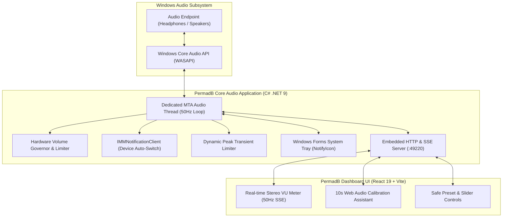

# 🛡️ Permanent Decibel & Hearing Protection Guard

     

**An open-source, always-on Windows system tray utility that permanently enforces safe, comfortable decibel listening levels across all devices, games, videos, and applications.**

---

## 📖 Table of Contents

- [🎧 Overview](#-overview)
- [🔬 How PermadB Protects Your Hearing](#-how-permadb-protects-your-hearing)
- [✨ Key Features](#-key-features)
- [🎧 DJ, Club Events & Live Sound Protection](#-dj-club-events--live-sound-protection-virtualdj-serato-traktor)
- [🩺 Acoustic Safety & WHO Guidelines](#-acoustic-safety--who-guidelines)
- [🎛️ Safe Listening Presets](#️-safe-listening-presets)
- [🏗️ System Architecture](#️-system-architecture)
- [🚀 Quick Start (Installation & Tray Setup)](#-quick-start-installation--tray-setup)
- [🔐 Deployment Architecture](#-deployment-architecture-development-vs-production-signing)
- [🛠️ Building from Source](#️-building-from-source)
- [🗺️ Milestones / Project Status](#️-milestones--project-status)
- [📄 License](#-license)

---

## 🎧 Overview

Permanent hearing damage and tinnitus are irreversible. Modern audio devices and soundcards can easily output acoustic levels upwards of $105\text{ dBA}$ directly into ears or high-power speakers, yet operating systems offer **zero native protection** against uncompressed audio spikes in games, deafening video ads, or accidental volume slider jumps to 100%.

**PermadB** solves this by running permanently in your Windows system tray, actively monitoring CoreAudio endpoints at 50Hz to ensure that every song, movie, game, voice call, or live mix is automatically capped and maintained at safe, fatigue-free decibel levels.

---

## 🔬 How PermadB Protects Your Hearing

### 1. The Acoustic Challenge: Digital $dBFS$ vs. Real-World $dB\text{ SPL}$
* **Digital Volume ($dBFS$):** Windows only sees digital values from $-\infty$ to $0\text{ dBFS}$. It has no awareness of whether you plugged in sensitive in-ear monitors or quiet desktop speakers.
* **Acoustic Pressure ($dB\text{ SPL}$):** This is the physical sound pressure hitting your eardrum. Prolonged exposure to $\ge 85\text{ dBA}$ causes irreversible cochlear hair cell loss.
* **PermadB's Solution:** Combines per-device acoustic profiling, a 10-second reference calibration wizard, and a double-layer hardware volume governor to bridge digital audio to real-world ear safety.

### 2. Double-Layer Safety Net ($< 15\text{ ms}$ Interception)
* **Layer 1: Real-time Event Interception (`IAudioEndpointVolumeCallback`)**  
  Intercepts hardware volume changes at the driver level in under **15 milliseconds**. If an external app, keyboard knob, or accidental scroll tries to spike the volume past your safe ceiling, PermadB snaps it right back down.
* **Layer 2: Proactive 50Hz Watchdog Loop**  
  A dedicated background MTA audio thread polls the audio endpoint 50 times per second, ensuring that even if an event packet is dropped by Windows COM, the volume can never stay above your ceiling for more than $20\text{ ms}$.

### 3. Dynamic Transient Limiter (Ear Shield)
Samples hardware peak meters (`IAudioMeterInformation`) at 50Hz. When an uncompressed jumpscare, gunshot burst, or loud video ad spikes toward clipping, PermadB applies intelligent micro-ducking to protect your ears, smoothly recovering when normal levels resume.

---

## ✨ Key Features

* **🛡️ Permanent System Tray Resident:**  
  Consumes $< 0.1\%$ CPU and ~60 MB RAM. Crisp anti-aliased dynamic shield icon:
  * 🟢 **Green Shield**: Active & Protecting.
  * 🟡 **Amber Shield**: Custom User Ceiling Active.
  * ⚪ **Gray Shield with Red Slash**: Protection Bypassed.
* **🔒 Strict Ceiling Guard:**  
  Enforces your safe volume ceiling in under 15ms. You can freely turn down your volume to quieter levels anytime (lower = safer), but if an accidental bump, application, or volume knob tries to push past your safe limit, PermadB immediately clamps it back down.
* **🎮 Per-Application Sound Mixer Guard (Game & App Leveler):**  
  Actively monitors every application running in the Windows Sound Mixer (`cs2.exe`, `discord.exe`, `chrome.exe`, `spotify.exe`). If any game (like CS2 at `volume 1` console gain) or software outputs dangerously loud sound exceeding your safe preset limit, PermadB automatically levels and clamps that specific application's mixer slider down to keep your ears safe.
* **🎧 Smart Device Auto-Switching:**  
  Automatically detects when you switch from headphones to speakers or HDMI and instantly applies that device's saved safe profile.
* **🌐 Multi-Device Broadcast Guard (DJ / PA / All Outputs):**  
  Enforces your safe decibel ceiling across **all connected audio devices simultaneously**. Perfect for live DJ setups (VirtualDJ, Serato, Traktor), venues, big PA speakers, and cue headphones so no output can ever blast deafening audio.
* **🎤 Microphone Feedback & Spikes Guard:**  
  Monitors microphone input gain (`DataFlow.Capture`) to prevent sudden shouting, singing peaks, and feedback squeals from blowing through the speakers.
* **🎛️ 10-Second Calibration Wizard with All-Device Sync:**  
  Features a built-in soothing reference tone (-18 dBFS) with a 1-click **"Enforce Across All Connected Devices"** toggle to synchronize your safe acoustic baseline across every speaker and headphone.
* **🖱️ Instant Right-Click Tray Menu:**  
  Toggle protection on/off, switch presets, lock volume, toggle all-device broadcast, open the dashboard, or configure Windows startup with a single click.
* **📊 Modern Web Dashboard:**  
  Fluid 50Hz stereo LED VU meters, digital dBFS readouts, estimated acoustic dBA SPL, connected device counts, and daily hearing protection stats.

---

## 🎧 DJ, Club Events & Live Sound Protection (VirtualDJ, Serato, Traktor)

For DJs, event hosts, and live audio performers:

### 1. Multi-Endpoint Broadcast Protection
DJ setups split audio into several physical channels:
* **Master Output:** Sent to high-wattage PA speakers, subwoofers, or amplifiers.
* **Cue Output:** Sent to DJ headphones for track monitoring.
* **Booth Monitors:** Secondary stage speakers.
* **Microphone Input:** The host/singer's mic plugged into the audio interface or USB port.

When **"Protect All Connected Devices"** is toggled, PermadB simultaneously locks every single connected output to your designated safe ceiling. If anyone accidentally spins the master output knob to 100% or bumps the system volume slider, PermadB snaps it right back in $< 15\text{ ms}$.

### 2. Microphone Feedback & Spikes Guard
When a performer sings or speaks closely into a microphone, sudden shouts or proximity feedback squeals can blast ears through the PA system. PermadB monitors Windows capture endpoints (`DataFlow.Capture`) and clamps microphone gain/volume scalar so it can never exceed the safe ceiling.

### 3. VirtualDJ / DJ Software Audio Driver Tip
* **WASAPI Mode (Recommended):** Set VirtualDJ's audio engine to **WASAPI** (the Windows default). In this mode, audio routes through Windows CoreAudio, giving PermadB 100% protection over the master output, headphones, and dynamic limiter.
* **ASIO Drivers:** If your DJ hardware requires low-latency ASIO drivers, note that ASIO bypasses the Windows volume mixer. To ensure PermadB can protect your audience and ears, select **WASAPI** or **DirectX / CoreAudio** inside VirtualDJ Settings -> Audio.

---

## 🩺 Acoustic Safety & WHO Guidelines

The World Health Organization (WHO) and NIOSH recommend a maximum weekly noise dose based on decibel levels:

| Sound Level | Daily Safe Limit | PermadB Mode | Real-World Equivalent |
| :--- | :--- | :--- | :--- |
| **< 60 dBA** | **Infinite (100% Safe)** | 🌙 **Night Mode** | Quiet library, soft conversational whisper |
| **60 – 75 dBA** | **Infinite (All Day)** | 🛡️ **Safe Ears (Recommended)** | Normal relaxed speech, comfortable background music |
| **75 – 85 dBA** | **4 – 8 hours / day** | 🎧 **Studio Dynamic** | Busy street traffic, dynamic orchestral peaks |
| **85 – 100+ dBA** | **< 15 minutes (Damage Risk)** | ❌ **PermadB Clamps & Ducks** | Loud concerts, uncompressed gaming gunshots, siren blasts |

---

## 🎛️ Safe Listening Presets

| Preset | Headphones Cap | Speakers Cap | Target Acoustic Level | Best For |
| :--- | :--- | :--- | :--- | :--- |
| 🛡️ **Safe Ears (Default)** | **65%** | **70%** | **~75 dBA** | Everyday listening, YouTube, gaming, all-day work sessions |
| 🌙 **Night / Relaxed** | **40%** | **45%** | **~60 dBA** | Late-night listening, podcasts, zero-fatigue quiet sessions |
| 🎧 **Studio / Dynamic** | **80%** | **85%** | **~85 dBA** | Critical mixing, dynamic film scores, wide dynamic range |
| ⚙️ **Custom Ceiling** | **30% – 95%** | **30% – 95%** | **User defined** | Manually set via tray quick submenu or dashboard slider |

---

## 🏗️ System Architecture



---

## 🚀 Quick Start (Installation & Tray Setup)

### 1-Click Setup Installer (`PermadB-Setup.exe`)
Download and run **`PermadB-Setup.exe`**:
* Installs cleanly to `%ProgramFiles%\PermadB` (or `%LOCALAPPDATA%\Programs\PermadB`) with UAC Administrator elevation.
* Automatically registers and binds the **PermadB Limiter APO** (`PermadBApo.dll`) into the Windows Audio Engine endpoint processing chain.
* Preserves OEM and hardware audio enhancement chains (EFX/MFX/SFX) with complete rollback backups.
* Creates **Desktop** and **Start Menu** shortcuts.
* Configures **Start with Windows** automatically.
* Registers in **Windows Settings -> Installed Apps / Add or Remove Programs** (complete with dedicated `Uninstall.exe` for 1-click clean removal and endpoint restoration).
* Launches PermadB immediately into your system tray!

---

## 🔐 Deployment Architecture: Development vs. Production Signing

### audiodg.exe & The Windows Audio Security Model
In Windows 11 and 10, the Windows Audio Engine (`audiodg.exe`) operates under Protected Process Light (PPL) isolation to protect multimedia DRM pipelines. By default, `audiodg.exe` will refuse to load any Audio Processing Object (APO) DLL that is not signed by Microsoft's production hardware root authority (`STATUS_IMAGE_CERT_REVOKED` / `0xC0000428`).

### Development / Test Mode (Current Open-Source Release)
To allow developers and users of this open-source project to run the high-performance C++ Limiter APO without requiring an expensive commercial EV Code Signing certificate ($500+/year) and Microsoft Hardware Dev Center account:
* The installer configures `HKLM\SOFTWARE\Microsoft\Windows\CurrentVersion\Audio\DisableProtectedAudioDG = 1`.
* This instructs Windows to permit unsigned or custom-compiled APO binaries inside `audiodg.exe`.
* Full PCM sample limiting, sub-millisecond lookahead brickwall safety, and endpoint chain preservation function immediately out-of-the-box.

### Commercial Production Requirements (Enterprise / OEM)
For enterprise distribution, OEM bundling, or commercial retail deployment without modifying `DisableProtectedAudioDG`:
1. **INF Packaging**: The APO DLL must be packaged with an Audio Driver INF (`Class=AudioProcessingObject`, `ClassGuid={5989fce8-9cd0-467d-8a6a-5419e31529d4}`).
2. **Microsoft Hardware Dev Center (WHDC)**: The driver package must be submitted to Microsoft WHDC.
3. **Attestation / WHQL Signing**: Microsoft validates the driver package and issues an official Microsoft Windows Hardware Compatibility Publisher digital signature embedded in the driver catalog (`.cat`).
4. **Protected PPL Loading**: With WHDC Attestation signing, `audiodg.exe` loads the APO natively under full PPL protection (`DisableProtectedAudioDG = 0`).

---

## 💡 Windows 11 System Tray Visibility Note
By default, Windows 11 tucks new background notification icons behind the **`^` (chevron)** overflow menu on the taskbar.
* Click the **`^`** chevron next to your clock.
* You will see the **PermadB green shield icon**.
* If you want it always visible directly on your main taskbar, simply **drag the shield icon** down onto your taskbar, or go to **Windows Settings -> Personalization -> Taskbar -> Other system tray icons** and switch **PermadB** to **On**.

---

## 🛠️ Building from Source

### Prerequisites
1. [.NET 9.0 SDK](https://dotnet.microsoft.com/download/dotnet/9.0)
2. [Node.js 20+](https://nodejs.org/)
3. [Visual Studio 2022 / Build Tools](https://visualstudio.microsoft.com/) with C++ desktop workload (`cl.exe`, `link.exe`, Windows 10/11 SDK)

### 1-Click Build Script
Run the automated build script:
```cmd
build.bat
```
This single script will:
1. Compile the native C++ Limiter APO (`PermadBApo.dll`) with full MSVC optimization (`/O2 /fp:fast`).
2. Bundle the React 19 UI into `PermadBCode/App/wwwroot/`.
3. Compile the .NET 9 CoreAudio application into `dist/`.
4. Compile the standalone `Uninstall.exe`.
5. Pack the self-contained single-file installer: **`PermadB-Setup.exe`**!

---

## 🗺️ Milestones / Project Status

### Current State
PermadB's core audio-processing concept has been proven on real Windows audio: PCM audio can pass through a PermadB APO and be constrained to a digital ceiling without changing Windows volume controls. The remaining major engineering milestone is converting the development-mode installation into a properly packaged and signed production Windows deployment.

---

### Milestone 1 — Fixed Attenuation APO
**Status: VERIFIED**
* PermadB successfully loaded as a Windows APO.
* Windows audio passed through the APO.
* PCM audio was modified by the APO.
* Windows Master Volume remained unchanged.
* Verified with the HyperX Cloud III Wireless endpoint.

### Milestone 2 — Real-Time Lookahead Limiter
**Status: VERIFIED**
* Replaced fixed attenuation with a real lookahead peak limiter.
* Configured ceiling: `-1.0 dBFS`.
* Approximately 5 ms lookahead based on the actual sample rate.
* Linked multichannel peak detection.
* Deterministic DSP tests: **5/5 passed**.
* Live Windows APO test successfully limited `0.0 dBFS` input to approximately `-1.0 dBFS`.
* Verified at 48 kHz stereo.
* Windows Master Volume remained unchanged at 100%.

### Milestone 3 — Windows Integration
**Status: VERIFIED**
* PermadB runs inside the Windows audio processing path:
  `Windows Audio Engine → PermadB APO → Limited PCM → Playback Device`
* Live processing through `audiodg.exe` was verified.
* The limiter processes the PCM audio itself rather than controlling Windows volume.

### Milestone 4 — Installer
**Status: VERIFIED — DEVELOPMENT MODE**
* Automated installer created.
* Administrator elevation is implemented.
* APO registration and endpoint configuration are automated.
* Uninstall and rollback logic are implemented.
* Existing endpoint effect configuration is backed up and restored.
* The installer currently uses `DisableProtectedAudioDG=1` for unsigned development/testing.

> [!NOTE]
> `DisableProtectedAudioDG=1` is a **development/testing mechanism only**, NOT a production deployment solution.

### Milestone 5 — Volume Manipulation Removal
**Status: VERIFIED**
* PermadB does not enforce its limit by changing Windows Master Volume.
* Per-application/session volume manipulation was removed.
* Repository-wide audit found no remaining volume mutators.
* Live testing confirmed Windows Master Volume stayed unchanged while limiting occurred.

### Milestone 6 — Production Windows Deployment
**Status: NOT YET VERIFIED / IN PROGRESS**

Production signing and proper Windows driver/APO package deployment are not yet completed. The current unsigned development configuration (`DisableProtectedAudioDG=1`) works for local development and testing, but is NOT a production deployment solution.

Realistically, reaching full production deployment is divided into two clear phases:

#### 🛠️ Phase A — Free Engineering (Community Contributions Welcome!)
* [ ] Proper APO INF (`Class=AudioProcessingObject`)
* [ ] CAT generation via `Inf2Cat`
* [ ] Proper package structure
* [ ] Installer installs package (`pnputil /add-driver`)
* [ ] Uninstaller removes package (`pnputil /delete-driver`)
* [ ] No `DisableProtectedAudioDG` requirement
* [ ] Secure Boot ON compatibility
* [ ] Clean Windows 11 test
* [ ] Test HyperX
* [ ] Test another USB device
* [ ] Test Bluetooth
* [ ] Test built-in audio
* [ ] Verify Windows volume never changes
* [ ] Verify limiter still works

#### 🔑 Phase B — Microsoft Signing
* [ ] Create Hardware Dev Center / Partner Center account
* [ ] Get required certificate (EV Code Signing)
* [ ] Submit package
* [ ] Microsoft signs it (Attestation / WHQL)
* [ ] Download signed package
* [ ] Install on clean Windows 11
* [ ] Verify APO loads normally in `audiodg.exe` with full PPL protection
* [ ] Verify Secure Boot remains ON

---

### 🤝 Want to Help? Reach Out!
PermadB is an open-source initiative dedicated to preventing irreversible hearing damage and tinnitus. 

If you are a Windows audio/driver engineer, packaging specialist, or have experience with **Microsoft Hardware Dev Center (WHDC) attestation signing**, we would love your help to get PermadB fully signed and production-ready! 

* Open an Issue or Discussion on GitHub to collaborate on INF packaging and testing.
* If you or your organization can sponsor or assist with Microsoft Partner Center EV code signing, please get in touch!

---

## 📄 License

PermadB is open-source software licensed under the **[MIT License](file:///A:/Projects2/PermadB/LICENSE)**.

```
Copyright (c) 2026 PermadB
```

Enjoy your music, videos, and games with absolute peace of mind and healthy ears!
